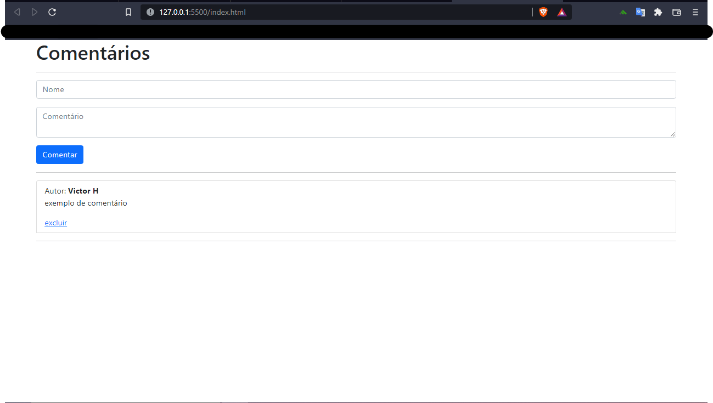

# Site-Comentarios-VueJs
Fiz um site responsivo de Comentários com VueJs, nele tem a função de:                       
° digitar o nome do author e o seu comentário                        
° Botão para postar o comentário no próprio site                           
° O comentário fica gravado e é mostrado na tela                                
° Opção de exclusão de algum comentário específico              
 
Segue uma imagem do site abaixo:

